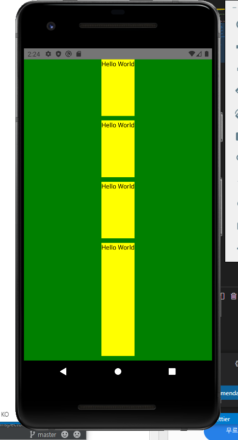
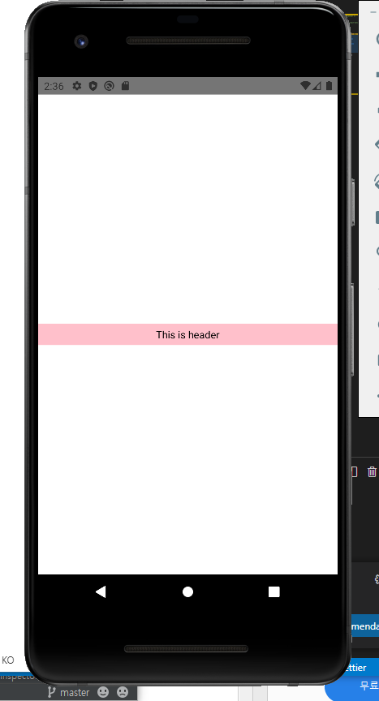

# Intro

### 리액트 네이티브

페이스북에서 만든 오픈소스 모바일 응용 프로그램. 네이티브 앱 개발을 위한 자바스크립트 프레임워크

단 하나의 코드 개발로 iOS와 Android에서 모두 구동이 가능하다.

<br>

### 기본 원리

단지 자바스크립트의 코드를 각 OS 플랫폼에 타겟팅 해준다고 생각

앱의 전체 로직을 갖고 있는 **JS Bundle**을 만들고 각 플랫폼의 JS Thread에 의해 실행되게 한다.

각 플랫폼의 Native Threads는 이 JS Thread와 직접 커뮤니케이션할 수 없고, 이 사이에서 **Bridge**역할을 리액트 네이티브가 하게 된다.

<br>

### JS Bundle을 만드는 방법

Expo CLI vs React Native CLI

Excp CLI

+ 개발 환경 구축이 쉽다.
+ 실제 개발이 쉽고 편하다.
+ OS Layer와 직접 상호작용 불가능하다. 즉, Java나 Kotlin, Swift와 상호작용이 불가능하다.
+ Expo에서 제공해주는 모듈만 사용이 가능하다.
+ 자유도가 낮다.

React Native CLI

+ Native 기능에 접근 가능하다.
+ 원하는 언어로 추가 작성 가능하다.
+ 필요한 기능이 있는 경우 모듈을 직접 제작 가능하다.
+ 초기 개발환경 구축 및 실제 앱 개발 시간이 다소 소요된다.
+ Mac일 경우에만 iOS/Android 지원한다.

<br>

<br>

# 프로젝트 생성

`react-native init --version 0.61.5 프로젝트명` (`react-native init 프로젝트명`)

### 안드로이드 에뮬레이터 구동

안드로이드 스튜디오에서 AVD Manager로 기기를 켠 후,

`react-native run-android`

RR - 새로고침

ctrl M - 메뉴

<br>

<br>

# React Native

기본적으로 App.js가 화면에 출력된다. 왜? index.js에 그렇게 써있으니깐.

구성을 바꿔보자.

```react
import React from 'react'
import {View, Text} from 'react-native'

class App extends React.Component {
  render() {
    return (
      <View>
        <Text>Hello World</Text>
      </View>
    )
  }
}

export default App
```

### View, Text

View는 다른 컴포넌트들을 감싸주는 역할을 한다. HTML의 div 같은 역할을 하지만, 화면에 요소로서 드러나지는 않는 역할이다.

Text는 텍스트를 출력한다.

<br>

### Style

#### 인라인 스타일링

```react
class App extends React.Component {
  render() {
    return (
      <View style={{
        backgroundColor: 'green',
        height: '100%',
        marginTop: 50,
      }}>
        <Text>Hello World</Text>
      </View>
    )
  }
}
```

#### StyleSheet

이 방법을 더 많이 쓸 것이다.

+ StyleSheet를 import한다.
+ const styles = StyleSheet.create ({}) 를 만든다.

```react
import {View, Text, StyleSheet} from 'react-native'

class App extends React.Component {
  render() {
    return (
      <View style={styles.mainView}>
        <Text>Hello World</Text>
      </View>
    )
  }
}

const styles = StyleSheet.create({
  mainView: {
    alignItems: 'center',
    backgroundColor: 'green',
    flex: 1,
    justifyContent: 'center',
  }
})
```

flex는 화면을 차지하는 요소들의 화면 차지 비율이다. 1은 100%

조금 더 스타일링 실험을 해보자. flex는 어떻게 적용될까

```react
class App extends React.Component {
  render() {
    return (
      <View style={styles.mainView}>
        <View style={styles.subView}>
          <Text>Hello World</Text>
        </View>
        <View style={styles.subView}>
          <Text>Hello World</Text>
        </View>
        <View style={styles.subView}>
          <Text>Hello World</Text>
        </View>
        <View style={styles.anotherSubView}>
          <Text>Hello World</Text>
        </View>
      </View>
    )
  }
}

const styles = StyleSheet.create({
  mainView: {
    alignItems: 'center',
    backgroundColor: 'green',
    flex: 1,
    justifyContent: 'center',
  },
  subView: {
    backgroundColor: 'yellow',
    flex: 1,
    marginBottom: 10,
  },
  anotherSubView: {
    backgroundColor: 'yellow',
    flex: 2,
    marginBottom: 10,
  },
})
```



결과는 다음과 같다. flex는 상위 요소에 대하여 얼마의 비율을 차지하냐이다. 세 요소가 1씩, 마지막 요소가 2를 가져갔으니 각각 20%, 20%, 20%, 40%를 차지한다.

이것저것 스타일링 코드들

```react
const styles = StyleSheet.create({
  mainView: {
    alignItems: 'center',
    backgroundColor: 'green',
    flex: 1,
    justifyContent: 'center',
  },
  subView: {
    backgroundColor: 'yellow',
    flex: 1,
    marginBottom: 10,
  },
  anotherSubView: {
    alignItems: 'center',
    backgroundColor: 'yellow',
    flex: 2,
    justifyContent: 'center',
    marginBottom: 10,
    width: '100%',
  },
  mainText: {
    fontSize: 20,
    fontWeight: 'bold',
    color: 'red',
    padding: 20,
  }
})
```

<br>

### Touch Event

터치 이벤트는 굉장히 중요한 이벤트다. 모바일이라면~

프로젝트 폴더에서 src폴더를 만들고 그 안에 header.js를 생성해보자.

header.js의 기본 뼈대는 다음과 같이 설정한다.

```react
import React from 'react'
import {View, Text, StyleSheet} from 'react-native'

const Header = () => {
  return (
    <View style={styles.header}>
      <Text>
        This is header
      </Text>
    </View>
  )
}

const styles = StyleSheet.create({
  header: {
    backgroundColor: 'pink',
    alignItems: 'center',
    padding: 5,
    width: '100%',
  }
})

export default Header
```

App.js에서 이를 import하자.

```react
import Header from './src/header'

class App extends React.Component {
  render() {
    return (
      <View style={styles.mainView}>
        <Header />
      </View>
    )
  }
}
```



props를 써보자.

```react
class App extends React.Component {

  state = {
    appName: 'My first app'
  }

  render() {
    return (
      <View style={styles.mainView}>
        <Header name={this.state.appName}/>
      </View>
    )
  }
}


const Header = ({ name }) => {
  return (
    <View style={styles.header}>
      <Text>
        {name}
      </Text>
    </View>
  )
}
```

이제 정말 Touch Event를 만들어보자.

**TouchableOpacity**라는 것을 임포트한다. 얘는 눌렀을 때 잠시 투명해진다.

```react
import {View, Text, StyleSheet, TouchableOpacity} from 'react-native'

const Header = ({ name }) => {
  return (
    <TouchableOpacity
    style={styles.header}
    onPress={() => alert('hello world')}
    >
      <View>
        <Text>{name}</Text>
      </View>
    </TouchableOpacity>
  )
}
```

**TouchableWithoutFeedback**는 아무 변화가 일어나지 않는다. 동시에 View에 아무런 영향을 주지 않기 때문에 style을 View로 옮겨야 한다.

```react
import {View, Text, StyleSheet, TouchableOpacity, TouchableWithoutFeedback} from 'react-native'

const Header = ({ name }) => {
  return (
    <TouchableWithoutFeedback
    onPress={() => alert('hello world')}
    >
      <View style={styles.header}>
        <Text>{name}</Text>
      </View>
    </TouchableWithoutFeedback>
  )
}
```

다시 TouchableOpacity로 돌아오고, 다른 이벤트들을 설정해보자.

```react
const Header = ({ name }) => {
  return (
    <TouchableOpacity
    style={styles.header}
    // onPress={() => alert('hello world')}
    // onLongPress={() => alert('hello world')}
    // onPressIn={() => alert('hello world')}
    onPressOut={() => alert('hello world')}
    >
      <View>
        <Text>{name}</Text>
      </View>
    </TouchableOpacity>
  )
}
```

+ onPress: 일반적
+ onLongPress: 길게 누를 때
+ onPressIn: 누르자마자
+ onPressOut: 눌렀다가 뗐을 때

얘네들은 TouchableOpacity가 아니어도 그냥 쓸 수 있다.

<br>

### Button

src폴더에 generator.js 생성

코드는 다음과 같이 한다.

+ 버튼을 쓰려면 Button을 임포트
+ 버튼에는 **title**이라는 프로퍼티가 필수적이다.

```react
import React from 'react'
import {View, Text, StyleSheet, Button} from 'react-native'

const Generator = ({ name }) => {
  return (
      <View style={styles.generator}>
        <Button 
        title="Add Number"
        onPress={() => alert('button pressed')}
        
        />
      </View>
  )
}

const styles = StyleSheet.create({
  generator: {
    backgroundColor: '#D197CF',
    alignItems: 'center',
    padding: 5,
    width: '100%',
  }
})

export default Generator
```

App.js에서 임포트

```react
import Generator from './src/generator'

class App extends React.Component {

  state = {
    appName: 'My first app'
  }

  render() {
    return (
      <View style={styles.mainView}>
        <Header name={this.state.appName}/>

        <View>
        <Text
          onLongPress={() => {alert('hello world')}}
        >press</Text>
        </View>

        <Generator />
      </View>
    )
  }
}
```

버튼을 눌렀을 때마다 랜덤으로 숫자를 생성해서 App이 갖고 있는 state에 random이라는 배열 안에 추가되도록 해보자.

우선, App.js에서 만든 함수를 props로 보내 Generator.js에서 버튼을 누르면 실행되도록 해보자.

+ 이 구조를 익혀놔야한다.

```react
class App extends React.Component {
  ...
  
  onAddRandomNum = () => {
    alert('Generate Number!')
  }

  ...

        <Generator add={this.onAddRandomNum} />
      </View>
    )
  }
}
```

```react
const Generator = ({ add }) => {
  return (
      <View style={styles.generator}>
        <Button 
        title="Add Number"
        onPress={() => add()}
        
        />
      </View>
  )
}
```

src 폴더 아래에 numList.js를 만들어보자

```react
import React from 'react'
import {View, Text, StyleSheet} from 'react-native'

const NumList = ({ num }) => {
  return (
    num.map((item, index) => (
      <View key={index} style={styles.numList}>
        <Text>{item}</Text>
      </View>
    ))
  )
}

const styles = StyleSheet.create({
  numList: {
    backgroundColor: '#cecece',
    alignItems: 'center',
    padding: 5,
    width: '100%',
    marginTop: 5,
  }
})

export default NumList
```

App.js 에서는 다음과 같이 Props를 전해준다. `<NumList num={this.state.random} />`

이제 Add Number 버튼을 누르면 랜덤 숫자가 추가되도록 해보자.

랜덤 숫자를 만드는 로직이다. Math.random()은 0~1 사이의 숫자를 반환하며, Math.floor는 버림이다.

+ `...`을 잘쓰는 것이 매우 중요하다. setState에서는 추가가 아닌 다시 set해주는 역할을 하기 때문에 ...으로 기존 요소들을 전부 가져오는 것이 필요하다.

```react
onAddRandomNum = () => {
  const randomNum = Math.floor(Math.random() * 100) + 1
  this.setState(current => {
    return {
        random: [         
        ...current.random,
        randomNum,
      ],
    }
  })
}
```

삭제하는 로직도 만들어보자.

```react
// App.js
...

onNumDelete = (index) => {
  const newArray = this.state.random.filter((num, idx) => {
    return index !== idx
  })
  this.setState({
    random: newArray,
  })
}


...
		<NumList 
          num={this.state.random}
          del={this.onNumDelete}
        />


// numList.js
import {View, Text, StyleSheet, TouchableOpacity} from 'react-native'

const NumList = ({ num, del }) => {
  return (
    num.map((item, index) => (
      <TouchableOpacity
        key={index}
        style={styles.numList}
        onPress={() => del(index)}
      >
        <View>
          <Text>{item}</Text>
        </View>
      </TouchableOpacity>
    ))
  )
}
```

